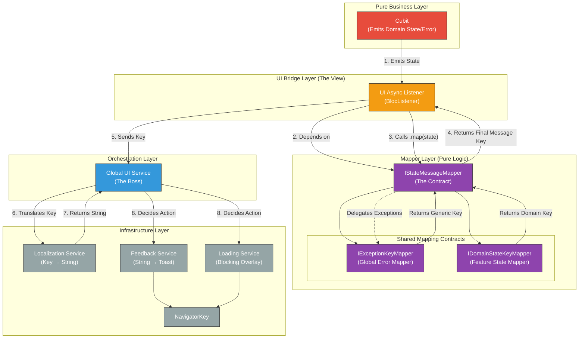

# cubit_ui_flow Integration Guide

A contracts-only library for Cubit state to UI feedback orchestration. No UI implementations - just the orchestration layer.

## Architecture Flow



## What the Library Provides

**Contracts Only:**
- `IAsyncState` interface + `AsyncStateMixin`
- `MessageKey` system for type-safe localization
- `IStateMessageMapper` orchestration contracts
- `AsyncUiListener` widget that wires everything together

**What You Must Implement:**
- `ILocalizationService` - your l10n system
- `IExceptionKeyMapper` - global exception → message key mapping  
- `IFeedbackService` - your toast/snackbar system
- `ILoadingService` - your loading overlay system
- `IGlobalUiService` - orchestrator (or use provided default)
- `IDomainStateKeyMapper<S>` - per-feature success/info messages (optional)

---

## Integration Steps

### 1. Create Your State (with AsyncStateMixin)

```dart
@freezed
class TrackerState with _$TrackerState, AsyncStateMixin {
  const factory TrackerState({
    @Default(AsyncStatus.idle) AsyncStatus status,
    @Default([]) List<Tracker> trackers,
    Object? error,
    // Your domain fields...
    TrackerAction? lastAction,
    Tracker? tracker,
  }) = _TrackerState;
}
```

### 2. Implement Required Services

#### ILocalizationService (REQUIRED)
```dart
class AppLocalizationService implements ILocalizationService {
  final AppLocalizations Function() _getL10n;
  
  AppLocalizationService(this._getL10n);
  
  @override
  String translate(String key, {Map<String, dynamic>? args}) {
    final l10n = _getL10n();
    return switch (key) {
      // Library keys
      'async_ui.error.generic' => l10n.errorGeneric,
      'async_ui.error.network' => l10n.errorNetwork,
      'async_ui.success.generic' => l10n.successGeneric,
      
      // Your app keys
      'tracker.created' => l10n.trackerCreated(args?['name'] ?? ''),
      'tracker.deleted' => l10n.trackerDeleted,
      'error.validation.name' => l10n.errorNameRequired,
      
      _ => key, // Fallback
    };
  }
  
  @override
  bool hasKey(String key) => true;
}
```

#### IExceptionKeyMapper (REQUIRED - Global)
```dart
class AppExceptionKeyMapper implements IExceptionKeyMapper {
  @override
  MessageKey? map(Object exception) {
    return switch (exception) {
      NetworkException() => MessageKey.networkError,
      TimeoutException() => MessageKey.timeoutError,
      AuthException() => const MessageKey.error('error.auth'),
      ValidationException e => MessageKey.error(
          'error.validation.${e.field}',
          {'field': e.field},
        ),
      StorageException() => const MessageKey.error('error.storage'),
      _ => null, // Falls back to MessageKey.genericError
    };
  }
}
```

#### IFeedbackService (REQUIRED - Your Toast System)
```dart
class AppFeedbackService implements IFeedbackService {
  @override
  void show(FeedbackMessage message) {
    // Use your preferred toast library
    switch (message.type) {
      case MessageType.error:
        Fluttertoast.showToast(
          msg: message.message,
          backgroundColor: Colors.red,
        );
      case MessageType.success:
        Fluttertoast.showToast(
          msg: message.message,
          backgroundColor: Colors.green,
        );
      // ... other types
    }
  }
  
  @override
  void dismiss() {
    Fluttertoast.cancel();
  }
}
```

#### ILoadingService (REQUIRED - Your Loading System)
```dart
class AppLoadingService implements ILoadingService {
  bool _isLoading = false;
  
  @override
  void show() {
    if (_isLoading) return;
    _isLoading = true;
    EasyLoading.show(); // or your loading library
  }
  
  @override
  void hide() {
    _isLoading = false;
    EasyLoading.dismiss();
  }
  
  @override
  bool get isLoading => _isLoading;
}
```

### 3. Create Feature-Specific Domain Mappers (RECOMMENDED)

Each feature should have its own domain mapper for success/info messages:

```dart
// Tracker feature domain mapper
class TrackerDomainMapper implements IDomainStateKeyMapper<TrackerState> {
  @override
  MessageKey? map(TrackerState state) {
    // Only return keys for states that need user feedback
    if (state.isSuccess && state.lastAction == TrackerAction.created) {
      return MessageKey.success(
        'tracker.created', 
        {'name': state.tracker?.name}
      );
    }
    if (state.isSuccess && state.lastAction == TrackerAction.deleted) {
      return const MessageKey.success('tracker.deleted');
    }
    
    // Return null for states that don't need feedback
    return null;
  }
}

// Settings feature domain mapper
class SettingsDomainMapper implements IDomainStateKeyMapper<SettingsState> {
  @override
  MessageKey? map(SettingsState state) {
    if (state.isSuccess && state.lastAction == SettingsAction.saved) {
      return const MessageKey.success('settings.saved');
    }
    if (state.isSuccess && state.lastAction == SettingsAction.exported) {
      return const MessageKey.info('settings.exported');
    }
    return null;
  }
}

// Auth feature domain mapper  
class AuthDomainMapper implements IDomainStateKeyMapper<AuthState> {
  @override
  MessageKey? map(AuthState state) {
    if (state.isSuccess && state.lastAction == AuthAction.loggedIn) {
      return MessageKey.success('auth.welcome', {'name': state.user?.name});
    }
    if (state.isSuccess && state.lastAction == AuthAction.loggedOut) {
      return const MessageKey.info('auth.goodbye');
    }
    return null;
  }
}
```

**Key Points:**
- Each feature creates its own domain mapper
- Domain mappers only handle success/info messages specific to that feature
- Return `null` for states that don't need user feedback
- Use meaningful message keys that match your localization system

### 4. Wire Up DI

```dart
void configureDependencies() {
  // Your services
  getIt.registerLazySingleton<ILocalizationService>(
    () => AppLocalizationService(() => getIt<AppLocalizations>()),
  );
  getIt.registerLazySingleton<IFeedbackService>(
    () => AppFeedbackService(),
  );
  getIt.registerLazySingleton<ILoadingService>(
    () => AppLoadingService(),
  );
  
  // Global mappers
  getIt.registerLazySingleton<IExceptionKeyMapper>(
    () => AppExceptionKeyMapper(),
  );
  
  // Orchestrator (use library default or your own)
  getIt.registerLazySingleton<IGlobalUiService>(
    () => GlobalUiService(
      localization: getIt(),
      feedback: getIt(),
      loading: getIt(),
    ),
  );
}
```

### 5. Use in Screens

```dart
class TrackerScreen extends StatelessWidget {
  @override
  Widget build(BuildContext context) {
    return AsyncUiListener<TrackerCubit, TrackerState>(
      // Required: mapper that combines global + feature-specific
      mapper: BaseStateMessageMapper(
        exceptionMapper: getIt<IExceptionKeyMapper>(),
        domainMapper: TrackerDomainMapper(), // Optional
      ),
      
      // Required: UI service
      uiService: getIt<IGlobalUiService>(),
      
      // Optional: show success messages
      showSuccessMessages: true,
      
      // Optional: custom logic (navigation, etc.)
      onStateChanged: (context, state) {
        if (state.shouldNavigateBack) {
          Navigator.of(context).pop();
        }
      },
      
      child: const TrackerScreenContent(),
    );
  }
}
```

### 6. Use in Cubits

#### Option A: Extend TryOperationCubit (Recommended)

```dart
class TrackerCubit extends TryOperationCubit<TrackerState> {
  TrackerCubit() : super(const TrackerState());
  
  // Async operation
  Future<void> loadTrackers() async {
    await tryOperation(() async {
      final trackers = await _repository.getAll();
      return state.copyWith(
        status: AsyncStatus.success,
        trackers: trackers,
      );
    });
  }
  
  // Async operation with domain data
  Future<void> createTracker(String name) async {
    await tryOperation(() async {
      final tracker = await _repository.create(name);
      return state.copyWith(
        status: AsyncStatus.success,
        trackers: [...state.trackers, tracker],
        lastAction: TrackerAction.created,
        tracker: tracker,
      );
    });
  }
  
  // Sync operation
  Future<void> clearTrackers() async {
    await tryOperation(() {
      return state.copyWith(
        status: AsyncStatus.success,
        trackers: [],
      );
    });
  }
  
  // Optional: customize state creation
  @override
  TrackerState createLoadingState() {
    return state.copyWith(
      status: AsyncStatus.loading,
      error: null, // Clear previous errors
    );
  }
  
  @override
  TrackerState createErrorState(Object error) {
    return state.copyWith(
      status: AsyncStatus.failure,
      error: error,
      // Keep existing data on error
    );
  }
}
```

#### Option B: Use TryOperationMixin

```dart
class TrackerCubit extends Cubit<TrackerState> with TryOperationMixin<TrackerState> {
  TrackerCubit() : super(const TrackerState());
  
  Future<void> loadTrackers() async {
    await tryOperation(() async {
      final trackers = await _repository.getAll();
      return state.copyWith(
        status: AsyncStatus.success,
        trackers: trackers,
      );
    });
  }
}
```

---

## How the Flow Works

```
1. User Action (e.g., "Create Tracker")
   ↓
2. Cubit.runSafe() → emits loading state
   ↓
3. AsyncUiListener detects status change → calls mapper.map(state)
   ↓
4. BaseStateMessageMapper checks:
   - Has error? → IExceptionKeyMapper.map(error) → MessageKey
   - Success? → IDomainStateKeyMapper.map(state) → MessageKey or null
   ↓
5. AsyncUiListener → uiService.handleMessage(messageKey)
   ↓
6. GlobalUiService:
   - Translates key via ILocalizationService
   - Shows loading via ILoadingService
   - Shows feedback via IFeedbackService
```

---

## Key Hookpoints

| Hookpoint | Required? | Purpose |
|-----------|-----------|---------|
| `ILocalizationService` | ✅ Yes | Connect to your l10n system |
| `IExceptionKeyMapper` | ✅ Yes | Map all app exceptions globally |
| `IFeedbackService` | ✅ Yes | Your toast/snackbar implementation |
| `ILoadingService` | ✅ Yes | Your loading overlay implementation |
| `IDomainStateKeyMapper<S>` | ❌ Optional | Per-feature success/info messages |
| `IGlobalUiService` | ❌ Optional | Use default or provide custom orchestration |

---

## Benefits

1. **Type-Safe Localization**: MessageKey system prevents missing translations
2. **Global Exception Handling**: One mapper handles all exceptions across features
3. **Testable**: Pure mapper functions, easy to unit test
4. **Flexible**: Plug in your own toast/loading libraries
5. **Consistent UX**: All async operations follow same feedback patterns
6. **Minimal Boilerplate**: AsyncUiListener handles the wiring

The library provides the contracts and orchestration - you provide the implementations that fit your app's UI system.