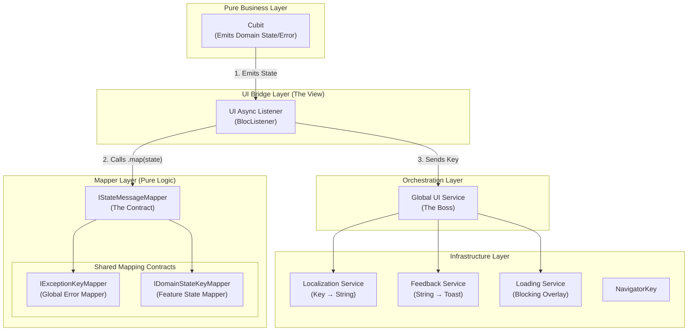

# cubit_ui_flow

Cubit state to UI feedback orchestration for Flutter. A contracts-based architecture that automatically handles loading overlays, error toasts, and success messages.

## Features

- 🔄 Automatic loading overlay management
- 🎯 Type-safe message key system for localization
- 🧩 Pluggable architecture with contracts-only approach
- 🎨 Consumer provides UI implementations (no default widgets)
- 🔌 Easy integration with flutter_bloc
- ⚡ Built-in try-catch wrappers for Cubit operations

## Installation

Add this to your package's `pubspec.yaml` file:

```yaml
dependencies:
  cubit_ui_flow: ^0.1.0
```

## Quick Start

### 1. Create Your State (with AsyncStateMixin)

```dart
@freezed
class TrackerState with _$TrackerState, AsyncStateMixin {
  const factory TrackerState({
    @Default(AsyncStatus.idle) AsyncStatus status,
    @Default([]) List<Tracker> trackers,
    Object? error,
    // Your domain fields...
    TrackerAction? lastAction,
    Tracker? tracker,
  }) = _TrackerState;
}
```

### 2. Implement Required Services

```dart
// Exception mapper (REQUIRED - Global)
class AppExceptionKeyMapper implements IExceptionKeyMapper {
  @override
  MessageKey? map(Object exception) {
    return switch (exception) {
      NetworkException() => MessageKey.networkError,
      AuthException() => const MessageKey.error('error.auth'),
      _ => null, // Falls back to generic
    };
  }
}

// Localization service (REQUIRED)
class AppLocalizationService implements ILocalizationService {
  @override
  String translate(String key, {Map<String, dynamic>? args}) {
    return switch (key) {
      'async_ui.error.generic' => 'Something went wrong',
      'async_ui.error.network' => 'Network error',
      'tracker.created' => 'Tracker "${args?['name']}" created',
      _ => key,
    };
  }
  
  @override
  bool hasKey(String key) => true;
}

// Your toast/feedback service (REQUIRED)
class AppFeedbackService implements IFeedbackService {
  @override
  void show(FeedbackMessage message) {
    // Use your preferred toast library
    Fluttertoast.showToast(msg: message.message);
  }
  
  @override
  void dismiss() => Fluttertoast.cancel();
}

// Your loading overlay service (REQUIRED)
class AppLoadingService implements ILoadingService {
  @override
  void show() => EasyLoading.show();
  
  @override
  void hide() => EasyLoading.dismiss();
  
  @override
  bool get isLoading => EasyLoading.isShow;
}
```

### 3. Use in Cubits

```dart
class TrackerCubit extends TryOperationCubit<TrackerState> {
  TrackerCubit() : super(const TrackerState());
  
  Future<void> createTracker(String name) async {
    await tryOperation(() async {
      final tracker = await _repository.create(name);
      return state.copyWith(
        status: AsyncStatus.success,
        trackers: [...state.trackers, tracker],
        lastAction: TrackerAction.created,
        tracker: tracker,
      );
    });
  }
}
```

### 4. Use in Screens

```dart
AsyncUiListener<TrackerCubit, TrackerState>(
  mapper: BaseStateMessageMapper(
    exceptionMapper: getIt<IExceptionKeyMapper>(),
    domainMapper: TrackerDomainMapper(), // Optional
  ),
  uiService: getIt<IGlobalUiService>(),
  showSuccessMessages: true,
  child: TrackerScreen(),
)
```

## Architecture

The library follows a layered architecture with clear separation of concerns:



## What You Get vs What You Provide

### Library Provides (Contracts + Orchestration)
- ✅ `IAsyncState` interface + `AsyncStateMixin`
- ✅ `MessageKey` system for type-safe localization
- ✅ `IStateMessageMapper` orchestration contracts
- ✅ `AsyncUiListener` widget that wires everything together
- ✅ `TryOperationCubit` and `TryOperationMixin` for automatic state management
- ✅ Default implementations for mappers and orchestration

### You Must Implement (Your UI System)
- 🔧 `ILocalizationService` - your l10n system
- 🔧 `IExceptionKeyMapper` - global exception → message key mapping  
- 🔧 `IFeedbackService` - your toast/snackbar system
- 🔧 `ILoadingService` - your loading overlay system
- 🔧 `IDomainStateKeyMapper<S>` - per-feature success/info messages (optional)

## Benefits

1. **Type-Safe Localization**: MessageKey system prevents missing translations
2. **Global Exception Handling**: One mapper handles all exceptions across features
3. **Testable**: Pure mapper functions, easy to unit test
4. **Flexible**: Plug in your own toast/loading libraries
5. **Consistent UX**: All async operations follow same feedback patterns
6. **Minimal Boilerplate**: AsyncUiListener handles the wiring
7. **Automatic State Management**: TryOperation classes handle loading/error states

## Documentation

- [Integration Guide](https://github.com/quanitya/flutter_cubit_ui_flow/blob/main/INTEGRATION_GUIDE.md) - Step-by-step setup
- [API Reference](https://pub.dev/documentation/cubit_ui_flow/latest/) - Full API docs
- [Examples](https://github.com/quanitya/flutter_cubit_ui_flow/tree/main/example) - Working examples

## License

MIT License - see [LICENSE](LICENSE) file for details.